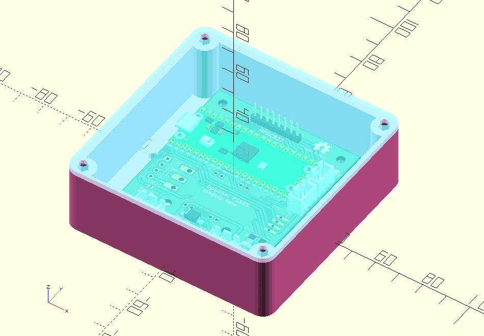

# Enclosure for low voltage controller hardware

3D printed case with a laser cut lid.
Option of "self tapping" or brass inserts for M3 hardware.
Bring your own cable exit and mounting solution (there is a default as an example, which may or may not be sufficient).

Parts needed:

- 1x `box.scad`
- 1x `lid.scad` (ideally in clear acrylic)
- 4x ~5mm M3 screw (for mounting PCB to box)
- 4x ~10mm M3 screw (for mounting lid to box)
- whatever else you need to mount the box to whatever you are controlling access to

